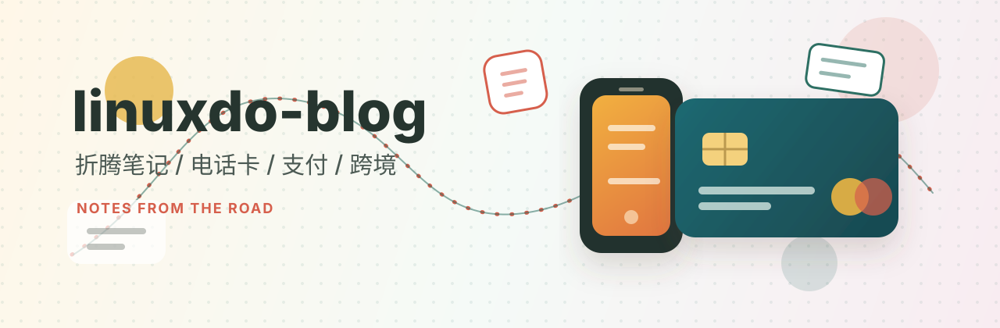

# Linux.do Blog

一些折腾记录，主要放海外电话卡、支付卡、Apple 美区支付、跨境汇款之类的内容。

## 目录

- [文章](#文章)
- [分类](#分类)
- [结构](#结构)
- [说明](#说明)

## 文章

| 时间 | 文章 | 关键词 |
| --- | --- | --- |
| 2026-07 | [Bitget U 卡开通记录](blog/2026-7-bitget.md) | Bitget、Fiat24、U 卡 |
| 2026-06 | [海外支付卡整理](blog/2026-6-ucard.md) | 支付卡、海外账户、U 卡 |
| 2026-06 | [美区 Apple 购买无法完成处理过程](blog/2026-6-apple-usa.md) | Apple ID、礼品卡、风控 |
| 2026-06 | [1000 美元跨境电汇流程和费用总结](wiki/1000-usd-cross-border-wire-summary.md) | 电汇、SWIFT、购汇结汇 |
| 2026-05 | [Giffgaff 电话卡申请踩坑记录](blog/2026-5-giffgaff.md) | giffgaff、白卡、eSIM |
| 快照 | [通过任意 Android 设备申请 Giffgaff eSIM](snapshot/giffgaff-esim-apply-use-hookeuicc.md) | HookEuicc、LSPatch、eSIM |

## 分类

- 电话卡：[Giffgaff 踩坑记录](blog/2026-5-giffgaff.md) / [Giffgaff eSIM 快照](snapshot/giffgaff-esim-apply-use-hookeuicc.md)
- 支付卡：[海外支付卡整理](blog/2026-6-ucard.md) / [Bitget U 卡](blog/2026-7-bitget.md)
- Apple：[美区 Apple 购买无法完成](blog/2026-6-apple-usa.md)
- 汇款：[1000 美元跨境电汇](wiki/1000-usd-cross-border-wire-summary.md)

## 结构

```text
.
├── blog/       # 记录
├── snapshot/   # 快照
└── wiki/       # 整理
```

## 说明

内容只是个人记录，很多东西都会变，实际操作前建议再确认一遍最新规则。
