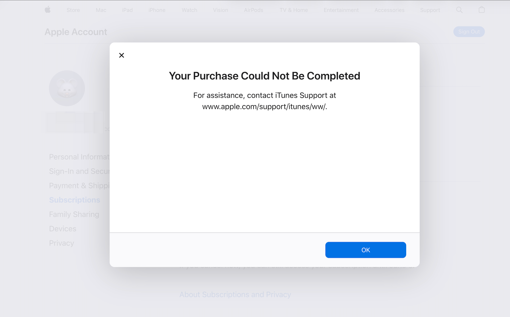
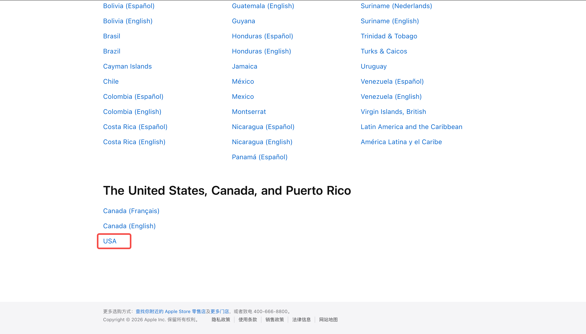
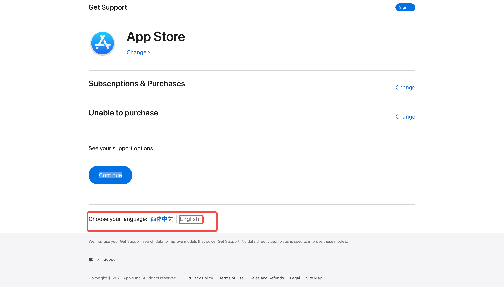
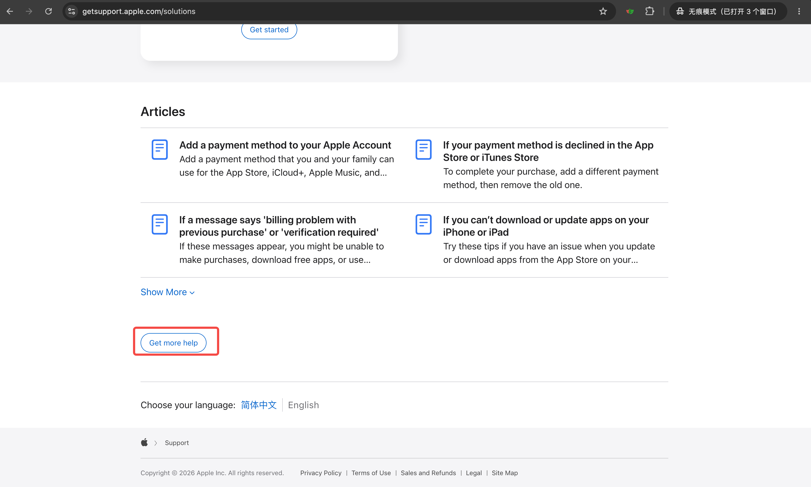
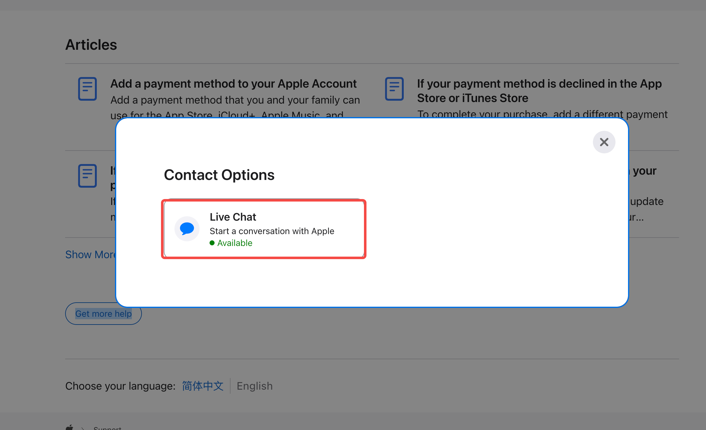
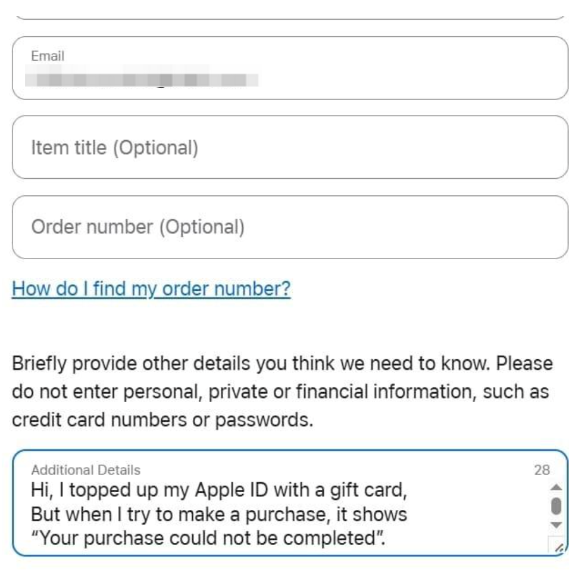
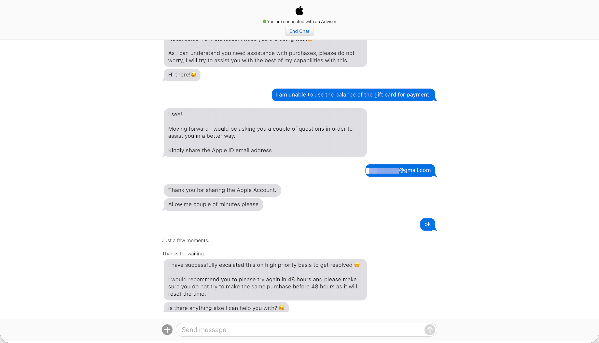

# 记升级 GPT 20x 美区 Apple 出现的 您的购买无法完成 解决过程

## 背景

2026 年 6 月 5日，明天我的GPT订阅就到期了，GPT 5x 这个月没有10x活动了现在感觉很不够用，而且比较起来20x来说也比较亏，昨天礼品卡重置了 200刀 今天一升级出现了错误【您的购买无法完成】，然后经过一系列的查询终于找到了一个解决方案，就是联系客服让解除账号的风控。



使用工具: 有道翻译

网络环境: 直连网络

## 步骤

首先使用浏览器的无痕模式去 https://account.apple.com/choose-country-region 网站。



我是美区的选择【USA】或者 【United States】（语言要选英文，但是我是美区就不用选，如果是土区的话需要选），然后我们就直接登录无法支付的那个账号 https://account.apple.com/sign-in。



登录之后去下面的这个网站。

然后去 https://getsupport.apple.com/products 这个网站，按照下面顺序选择。

- App Store
- Subscriptions & Purchases
- Unable to purchase

然后点击 【Continue】，滑倒最下面点击【Get more help】





选择 【Live Chat】，然后将下面的消息模版发送进去

```
Hi, I topped up my Apple ID with a gift card,

but when I try to make a purchase, it shows

“Your purchase could not be completed”.

Could you please help review my account?

I believe it may be restricted by the system.
```



然后点击 【Continue】等着就行，我大概等了 3 分钟。

然后就开始了下面的聊天。



```
CS: Thanks for contacting Apple Support. Please give me a moment to look over the information you have provided.

ME: hello

CS: Hello, aside from the issue, I hope you are doing well.😊

CS: As I can understand you need assistance with purchases, please do not worry, I will try to assist you with the best of my capabilities with this.
CS: Hi there!😊

ME: I am unable to use the balance of the gift card for payment.

CS: I see!
CS: Moving forward I would be asking you a couple of questions in order to assist you in a better way.
CS: Kindly share the Apple ID email address

ME: lydannegpt@gmail.com

CS: Thank you for sharing the Apple Account.
CS: Allow me couple of minutes please

ME: ok

CS: System MessageJust a few moments.
CS: System MessageThanks for waiting.
CS: I have successfully escalated this on high priority basis to get resolved 😊
CS: I would recommend you to please try again in 48 hours and please make sure you do not try to make the same purchase before 48 hours as it will reset the time.
Is there anything else I can help you with? 🤗
```

然后我们就等48小时后，直接升级就可以了。

我现在就很烦，还得充值 100 刀，明天就自动续订了，我都想晚上直接取消了。