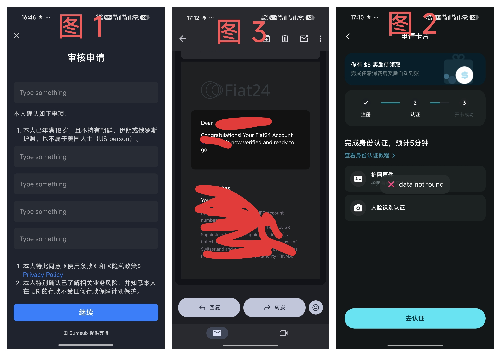

# 【快上车】折腾了一下午终于开通 bitget 这个神U卡成功了，顺便买了一个蜜雪冰城，香

等了小一个月终于拿到护照了，折腾了一下午，目前 bitget 整体感觉还可以，下个月使用 bitget 去买低价 GPT PRO 试试看。

正好刚刚弄完我简单说一下我在申请银行卡的时候的坑吧，我是使用的安卓 Redmi k90 ProMax。

在开通之前最好可以开一个 OKX 欧易，这块也有一堆坑，佬新开的时候要用推荐码，而且不要着急充值，先把任务领了（痛失 n 个 20U）

## 整体流程

- 打开香港的梯子
  - **坑1: ** 之前的教程都说不要用梯子，但是你现在不用梯子连软件都打不开
- Google Pay 下载 `Bitget Wallet`（我看教程里还让下载一个认证软件，但是我没下载整体流程也没提示我下载）
- Google Pay 下载 `Fake GPS`（fake location 有点坑要钱）
- 去闲鱼找一个代收邮件的，但是这个是可选，我看其他教程里都没有这一步，我是担心后面有什么账单啥的我就去买了一个。
- 设置虚拟定义
- 打开 Bitget Wallet
- 先注册钱包，然后去填推荐码
- 然后去银行卡这个功能里申请银行卡，一路跟着视频做就行
  - **坑2: **在最后就遇见一个填申请表【图 1】的，但是她这块也没有写清楚填什么，最后问了 GPT，就在第一个问题的下面的输入框写 `I confirm` 就行，其他的空着。
- 最后会弹出成功，并且会收到邮件【图 3】说你的 Fiat24 Account 激活成功
  - **坑3: **刚激活成功这时候这块 APP 里点击进去还是让开户，点击开户以后出现【data not found】【图 2】我当时以为完了被风控了，后来等了一会(10分钟)那个银行卡才变成视频教程的卡，然后也能查卡号。
  - **坑4: **本来想绑定支付宝小号的，之前为了充值 USDT 开的，但是绑定的时候支付宝被风控了，就很离谱，然后我只能用我大号，这时候就没啥问题了。
- 然后充值 11U 之后激活成功了，后面买了一个蜜雪冰城也挺顺利的。

## 其他注意事项

- 支付宝付款不要大于 200 每笔，大于 200 会收 3% 的手续费。
- 每个月只有 400 刀是免手续费的。
- （佬友补充）

## 这个卡能干啥

- 最重要的就是买 GPT、Claude，并且出现意外是可以退款的。
- 然后就是可以消费这些 U 币。

